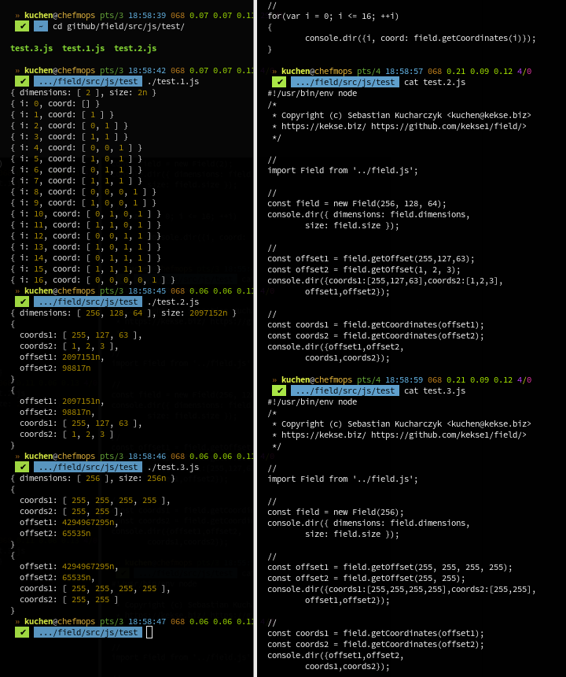

# Field
The [JavaScript](src/js/field.js) implementation is ready right now.
For an example see the [JavaScript **tests**](#tests).

> [!NOTE]
> My current plan is a JavaScript and a `bash` shell script implementation.

## Introduction
This is the best[tm] way to manage multi-dimensional arrays (of **any type**).

It's about arrays (of **any type**) without really nesting them,
but access with multi-dimensional coordinates. These coordinates
are calculated, similar to **radix/base conversions**. That's also
the reason why you even can use any `TypedArray` which doesn't
really support nesting 'em.

You can either use the dimensions and/or calculated offsets, or
directly the concrete data (if you've set an array before). In both
directions, so calculation of offsets and also coordinates.

## Download
* [JavaScript](src/js/field.js)
* [Bash Shell](src/sh/field.sh)

### Test(s)
* [JavaScript](src/js/test/)
* [Bash Shell](src/sh/test/)

#### Screenshot

# Contact

# Copyright and License
The Copyright is [(c) Sebastian Kucharczyk](./COPYRIGHT.txt),
and it's licensed under the [MIT](./LICENSE.txt) (also known as 'X' or 'X11' license).

